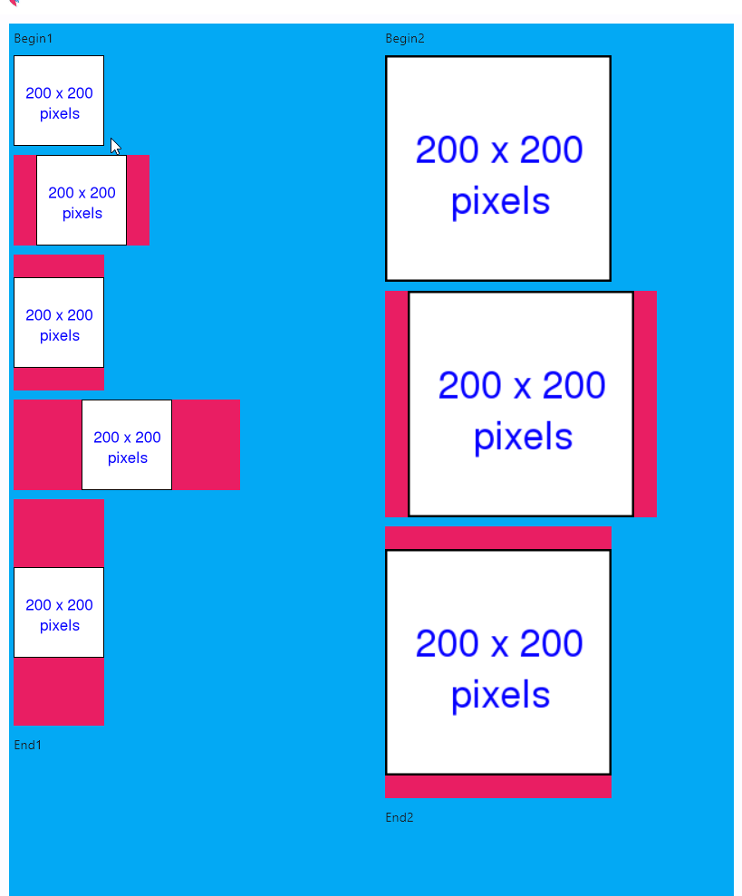

# flet_panzoom_control
Pan zoom control for flet

## Requirements
 - [flet]
 - Awesome size aware control by @ndonkoHenri https://github.com/ndonkoHenri/Flet-Custom-Controls

## Installation
 Copy the panzoom.py file to your flet project folder

## Features
 - Pan and zoom control for flet
 - Supports mouse wheel, mouse drag and click
 - In theory complex controls could be used in the future (not only images, but TODO)
 - Supports large images
 - Supports different image and viewport sizes, ratios
 - Supports padding with color so even thin or tall images can be dragged
 - Supports on_click event with local coordinates converted to image coordinates

## Screenshots




## Demo
 - [pan1.py](pan1.py) - Pan zoom control demo with different image and viewport sizes
 - [pan2.py](pan2.py) - Pan zoom control demo with a large image
 - [pan3.py](pan3.py) - Pan zoom control demo with a complex control (not working properly)

## Usage

```python

from panzoom import PanZoom
import flet as ft


def main(page: ft.Page):
    img = ft.Image(src='/img/Square_200x200.png', fit=ft.ImageFit.COVER)

    panzoom = PanZoom(img, 200, 200,
                      width=300,
                      height=300,
                      padding_color='red',  on_click=lambda e: print(f'CLICK {e.local_x} {e.local_y}'))


    page.add(ft.Container(width=800, height=800, content=panzoom, padding=5, bgcolor='lightblue'))

ft.app(target=main, assets_dir="assets", view=ft.AppView.WEB_BROWSER, port=8080)
```

## TODO
 - [ ] Add zoom in/out buttons
 - [ ] Add 1:1 button
 - [ ] Add reset button
 - [ ] Add pan/zoom animation
 - [ ] support content.scale instead of width and height
 - [ ] Better support complex Controls, see pan3.py 
 - [ ] Add support for touch events
 - [ ] Add support to move the content to a specific point with a zoom out-pan-zoom in animation
